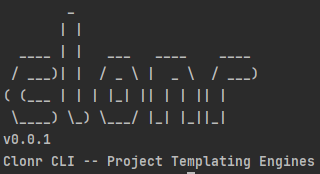

# Clonr Project Templating CLI

# About
This project is aimed to make creating template projects very easy, so that you can set up a project one time, and not worry about configuration again. 
Simply host your template project in a git repostory, configure your template variables in a .clonrrc file, as well as providing a placeholder in the 
template files, and run `clonr clone <repo_url>`. The rest will unfold before your eyes.

## Quick start
Make sure you have Go installed on your machine. [Find out how](https://golang.org/doc/install)

In your terminal: 
1. Clone the project 
`git clone https://github.com/OleDakotaJoe/clonr.git`
2. cd into the projects directory
3. Run `go build` to download all dependencies
4. Run `go run main.go version` to verify the install.

Now you can use the CLI!

To play with an example project, open your terminal and run 

`go run main.go clone https://github.com/OleDakotaJoe/clonr-example-template.git`

This will create a copy of the above git repo on your local machine under the directory 'clonr-app'.
The CLI will always install your project in your present working directory.
After you run this command, any template variables that are configured in your .clonrrc file will be picked up by the engine, 
and you will be asked to provide input via the terminal.

## Installation 


## Configuring a project.

To configure your project, simply place a file named `.clonrrc` into the root directory of the git repo.
Inside this yaml file you will need to provide the paths to the files which need to be processed, the name of the 
placeholder variables that you have provided in those files, and the questions which need to be asked to determine those variables.

### Basic Example
The root key in the yaml file must be "templates"

Here is an example of what the yaml syntax for clonr looks like:
```yaml
templates:
  README.md:
    location: /README.md
    variables:
      clonr_variable: 
        question: What do you want the value of this variable to be?
  LICENSE:
    location: /LICENSE
    variables:
      owner: 
        question: Who is the owner of the project?
      date: 
        question: When did your Copyright begin?
```

Variables can only contain lowercase letters, numbers, dashes, and underscores.

Syntax for placeholder variables within the template files:
```
{@clonr{your_variable_inside_these_brackets}}
```

You can include as many of these inside the files as you would like.


### Example With Globals
You may declare global variables by providing the key: `globals`. This will allow you to ask a question only one time, 
and use that variable in more than one file, without being required to get input from the user again.
Under globals, provide the key named `variables` and then simply provide the key for each variable name, and include your question below that.


In order to consume a global variable that you declared, in the variables section of the `templates` key, include the key `globals`.
you do not need to provide a value for that key, clonr will search the file for any placeholders that match a global variable, and make the swap. 

NOTE: If you do not need a variable to be available to more than one file, then provide that variable under templates, or you may see some performance issues.

Here is an example of a use case:
```yaml
globals:
  variables:
    project-name:
      question: What do you want the project name to be?
templates: 
  some-file.txt:
    location: /some-file.txt
    variables:
      globals: # This key lets clonr know that there are global variables in /some-file.txt, and to scan for them. You do not need to provide a corresponding value for this key
      some-other-variable:
        question: What do you want the value of some-other-variable to be?
```

The syntax for the placeholder for a global variable is as follows:
```
{@clonr{globals.project-name}}
```
Note that the syntax is identical, EXCEPT prefix your variable name with `globals.`

### Full Example: 
```yaml 
templates: 
  package.json:
    location: /package.json
    variables:
      - package-name: What do you want the package name to be?
```

And in your package.json file you might have this:
```json
{
  "name": "{@clonr{package-name}}",
  "version": "1.0.0"
}
```

When you run the CLI you will be asked:

```
    What do you want the package name to be?
```

Type in your response and then go check your results.
Let's say for example, my response was `awesome-react-app`
Your file should now look like this
```json
{
  "name": "awesome-react-app",
  "version": "1.0.0"
}
```


## Known Issues
Currently, only https git addresses are supported


## Commands

### Clone
The main command of the program. 
When you run `clonr clone <...args>`, clonr will first clone a git repository and then process the files in that repository
according to the `.clonrrc` file

#### Usage:
There are 2 ways to use the clone command.  
1. `clonr clone <git_url> <name_of_project>`
   * Clones a remote git repository
   * Replace `<git_url>` with the url you would use if running `git clone <url>`
   * `<name_of_project>` is optional. This will be the name of the directory (inside your working directory) where the project will be cloned to.
   * If you don't provide a name for your project, the name will be `clonr-app`
2. `clonr clone -local <local_path> <name_of_project>`
   * Clones a local directory on your filesystem.
   * Notice the `-local` flag. This indicates the local filepath. You can also use `-l` for short
   * Replace `<local_path>` with either an absolute or relative path to the directory you want to clone

NOTE: You can actually pass in the name using a `-name` flag, if you prefer.

This would look like this: `clonr clone <git_url> -name <name_of_project>`

### Version
Just run `clonr version` and you should see something like this: 
<br>



